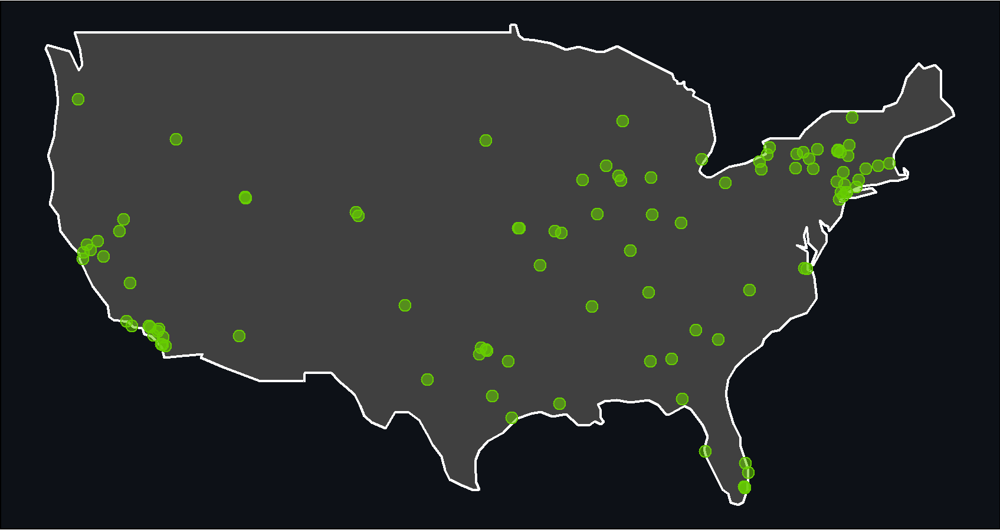

<!-- README.md is generated from README.Rmd. Please edit that file -->

# dyadicdist

<!-- badges: start -->

<!-- badges: end -->

The purpose of `dyadicdist` is to provide quick and easy calculation of
dyadic distances between geo-referenced points.

The main contribution of `dyadicdist::ddist()` is that the output is
stored as a long dyadic `tibble` with dimensions `((N * N), 2)` (number
of rows and columns vary with specified options) as opposed to a wide
`matrix` with dimensions `N * N`.

## Quick example

A simple example with no additional illustrates the workings of
`dyadicdist::ddist()`:

``` r
library(dyadicdist)
library(tidyverse)

df <- tibble::tribble(
  ~city_name, ~idvar, ~latitude, ~longitude,
  "copenhagen", 5, 55.68, 12.58,
  "stockholm", 2, 59.33, 18.07,
  "oslo", 51, 59.91, 10.75
)

dyadicdist::ddist(data = df,
                  id = "idvar")
#> # A tibble: 9 x 6
#>   distance city_name_1 idvar_1 city_name_2 idvar_2 match_id
#>      <dbl> <chr>         <dbl> <chr>         <dbl> <chr>   
#> 1       0  copenhagen        5 copenhagen        5 5_5     
#> 2  521455. copenhagen        5 stockholm         2 5_2     
#> 3  482648. copenhagen        5 oslo             51 5_51    
#> 4  521455. stockholm         2 copenhagen        5 2_5     
#> 5       0  stockholm         2 stockholm         2 2_2     
#> 6  416439. stockholm         2 oslo             51 2_51    
#> 7  482648. oslo             51 copenhagen        5 51_5    
#> 8  416439. oslo             51 stockholm         2 51_2    
#> 9       0  oslo             51 oslo             51 51_51
```

## Installation

You can install the development version from
[GitHub](https://github.com/) with:

``` r
if(!require("devtools")) install.packages("devtools")
library(devtools)
devtools::install_github("jvieroe/dyadicdist")
```

## Example

This is a basic example which shows you how to solve a common problem:

``` r
library(tidyverse)
library(magrittr)
library(janitor)
library(rvest)

city_url <- "https://www.latlong.net/category/cities-236-15.html"

cities <- city_url %>%
   read_html() %>%
   html_nodes("table")

cities <- rbind(html_table(cities[[1]])) %>% 
  janitor::clean_names()

cities <- cities %>% 
  mutate(city = sapply(strsplit(as.character(cities$place_name),","), "[", 1),
         state = sapply(strsplit(as.character(cities$place_name),","), "[", 2),
         country = sapply(strsplit(as.character(cities$place_name),","), "[", 3))

cities <- cities %>% 
  mutate(id = row_number())

cities
#> # A tibble: 100 x 7
#>    place_name            latitude longitude city         state country    id
#>    <chr>                    <dbl>     <dbl> <chr>        <chr> <chr>   <int>
#>  1 Plattsburgh, NY, USA      44.7     -73.5 Plattsburgh  " NY" " USA"      1
#>  2 Peekskill, NY, USA        41.3     -73.9 Peekskill    " NY" " USA"      2
#>  3 Oneida, NY, USA           43.1     -75.7 Oneida       " NY" " USA"      3
#>  4 New Rochelle, NY, USA     40.9     -73.8 New Rochelle " NY" " USA"      4
#>  5 Mount Vernon, NY, USA     40.9     -73.8 Mount Vernon " NY" " USA"      5
#>  6 Middletown, NY, USA       41.5     -74.4 Middletown   " NY" " USA"      6
#>  7 Lockport, NY, USA         43.2     -78.7 Lockport     " NY" " USA"      7
#>  8 Lackawanna, NY, USA       42.8     -78.8 Lackawanna   " NY" " USA"      8
#>  9 Kingston, NY, USA         41.9     -74.0 Kingston     " NY" " USA"      9
#> 10 Johnstown, NY, USA        43.0     -74.4 Johnstown    " NY" " USA"     10
#> # ... with 90 more rows
```

``` r
library(sf)
library(rnaturalearth)
library(rgeos)

usa <- rnaturalearth::ne_countries() %>% 
  sf::st_as_sf() %>% 
  filter(admin == "United States of America")

usa <- usa %>% 
  st_crop(.,
          st_bbox(c(xmin = -128,
                    xmax = -57,
                    ymin = 20,
                    ymax = 50),
                  crs = st_crs(usa)))

city_sf <- cities %>% 
  st_as_sf(.,
           coords = c("longitude", "latitude"),
           crs = 4326)

ggplot() +
  geom_sf(data = usa,
          fill = "grey25",
          color = "white") +
  geom_sf(data = city_sf,
          size = 2,
          shape = 21,
          fill = "chartreuse3", color = "NA",
          alpha = .55) +
  geom_sf(data = city_sf,
          size = 2,
          shape = 21,
          fill = "NA", color = "chartreuse3",
          alpha = 1.0) +
  theme_void() +
  theme(panel.background = element_rect(fill = "#0D1117"),
        plot.background = element_rect(fill = "#0D1117"))
```



# x

``` r
#library(dyadicdist)
## basic example code
```

What is special about using `README.Rmd` instead of just `README.md`?
You can include R chunks like so:

``` r
summary(cars)
#>      speed           dist       
#>  Min.   : 4.0   Min.   :  2.00  
#>  1st Qu.:12.0   1st Qu.: 26.00  
#>  Median :15.0   Median : 36.00  
#>  Mean   :15.4   Mean   : 42.98  
#>  3rd Qu.:19.0   3rd Qu.: 56.00  
#>  Max.   :25.0   Max.   :120.00
```
