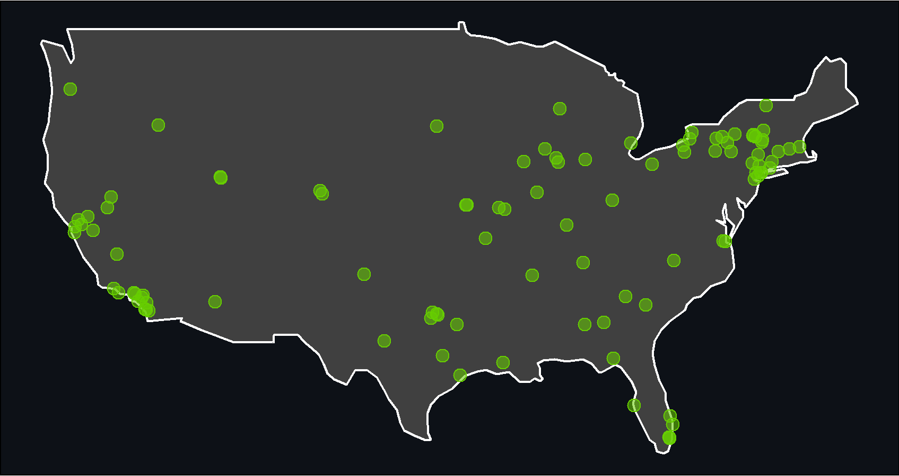

<!-- README.md is generated from README.Rmd. Please edit that file -->

# dyadicdist

<!-- badges: start -->

<!-- badges: end -->

The purpose of `dyadicdist` is to provide quick and easy calculation of
dyadic distances between geo-referenced points.

The main contribution of `dyadicdist::ddist()` is that the output is
stored as a long dyadic `tibble` as opposed to a wide `matrix`.

This is a very early development version of `dyadicdist`. Additional
functions and improved functionality will be added in the immediate
future. Please don’t hesitate to let me know of any errors you might
come across.

## Quick example

A simple example with no additional illustrates the workings of
`ddist()`. It takes as input a `data.frame` or a `tibble` and returns a
`tibble` with dyadic distances for any combination of points `i` and `j`
(see more below)

``` r
library(tidyverse)
library(dyadicdist)

df <- tibble::tribble(
  ~city_name, ~idvar, ~latitude, ~longitude,
  "copenhagen", 5, 55.68, 12.58,
  "stockholm", 2, 59.33, 18.07,
  "oslo", 51, 59.91, 10.75
)

ddist(data = df,
      id = "idvar")
#> # A tibble: 9 x 6
#>   distance city_name_1 idvar_1 city_name_2 idvar_2 match_id
#>      <dbl> <chr>         <dbl> <chr>         <dbl> <chr>   
#> 1       0  copenhagen        5 copenhagen        5 5_5     
#> 2  521455. copenhagen        5 stockholm         2 5_2     
#> 3  482648. copenhagen        5 oslo             51 5_51    
#> 4  521455. stockholm         2 copenhagen        5 2_5     
#> 5       0  stockholm         2 stockholm         2 2_2     
#> 6  416439. stockholm         2 oslo             51 2_51    
#> 7  482648. oslo             51 copenhagen        5 51_5    
#> 8  416439. oslo             51 stockholm         2 51_2    
#> 9       0  oslo             51 oslo             51 51_51
```

## Installation

You can install the development version from
[GitHub](https://github.com/) with:

``` r
if(!require("devtools")) install.packages("devtools")
library(devtools)
devtools::install_github("jvieroe/dyadicdist")
```

## Working example: US cities

Below, I describe some of the key features of `dyadicdist`. Let’s use
some data on the 100 largest US cities as a working example\!

``` r
cities <- dyadicdist::cities
usa <- dyadicdist::usa
```

Let’s have a look at the cities’ geographic location in the US:

``` r
library(sf)

city_sf <- cities %>%
  st_as_sf(.,
           coords = c("longitude", "latitude"),
           crs = 4326)

ggplot() +
  geom_sf(data = usa,
          fill = "grey25",
          color = "white") +
  geom_sf(data = city_sf,
          size = 2,
          shape = 21,
          fill = "chartreuse3", color = "NA",
          alpha = .55) +
  geom_sf(data = city_sf,
          size = 2.5,
          shape = 21,
          fill = "NA", color = "chartreuse3",
          alpha = 1.0) +
  theme_void() +
  theme(panel.background = element_rect(fill = "#0D1117"),
        plot.background = element_rect(fill = "#0D1117"))
```



## Basic functionality

`ddist()` has **two key inputs**. It requires a `data.frame` or `tibble`
with specified latitude and longitude variables. Furthermore, it
requires the specification of a unique id variable which can be either
`numeric`, `integer`, `factor`, or `character`.

``` r
ddist(cities,
      id = "id")
#> # A tibble: 10,000 x 10
#>    distance city_1     state_1 country_1  id_1 city_2    state_2 country_2  id_2
#>       <dbl> <chr>      <chr>   <chr>     <int> <chr>     <chr>   <chr>     <int>
#>  1       0  Rensselaer NY      USA         456 Renssela~ NY      USA         456
#>  2  229607. Rensselaer NY      USA         456 Plattsbu~ NY      USA         367
#>  3  151125. Rensselaer NY      USA         456 Peekskill NY      USA         405
#>  4  164483. Rensselaer NY      USA         456 Oneida    NY      USA          77
#>  5  191483. Rensselaer NY      USA         456 New Roch~ NY      USA          84
#>  6  192269. Rensselaer NY      USA         456 Mount Ve~ NY      USA         268
#>  7  144255. Rensselaer NY      USA         456 Middleto~ NY      USA         348
#>  8  408370. Rensselaer NY      USA         456 Lockport  NY      USA         396
#>  9  416629. Rensselaer NY      USA         456 Lackawan~ NY      USA         235
#> 10   82166. Rensselaer NY      USA         456 Kingston  NY      USA         297
#> # ... with 9,990 more rows, and 1 more variable: match_id <chr>
```

As a default, latitude/longitude are specified as `"latitude"` and
`"longitude"`, respectively, and don’t need manual inputs. If necessary
their variable names can be specified in the `ddist()` call:

``` r
cities_new <- cities %>% 
  rename(lat = latitude,
         lon = longitude)

ddist(cities_new,
      id = "id",
      latitude = "lat",
      longitude = "lon") %>% 
  head(2)
#> # A tibble: 2 x 10
#>   distance city_1     state_1 country_1  id_1 city_2     state_2 country_2  id_2
#>      <dbl> <chr>      <chr>   <chr>     <int> <chr>      <chr>   <chr>     <int>
#> 1       0  Rensselaer NY      USA         456 Rensselaer NY      USA         456
#> 2  229607. Rensselaer NY      USA         456 Plattsbur~ NY      USA         367
#> # ... with 1 more variable: match_id <chr>
```

## Output specification

By default, `ddist()` returns the full list of dyadic distances between
any points `i` and `j`, including `j = i`.

In total, this amount to `nrow(data) * nrow(data)` dyads and includes by
default:

  - dyads between any observation and itself, i.e. dyads of type `(i,i)`
    (see example above)
  - duplicated dyads, i.e. both `(i,j)` and `(j,i)`

Both of these inclusions are optional, however.

  - Sort out `(i,i)` dyads (the diagonal in a distance matrix) by
    specifying `diagonal = FALSE`
      - returns a `tibble` with `nrow(data) * (nrow(data)-1)` dyads
  - Sort out duplicated dyads by specifying `duplicates = FALSE`
      - returns a `tibble` with `(nrow(data) *
        (nrow(data)-1)/2)+nrow(data)` dyads
  - Sort out both by specifying `diagonal = FALSE` **and** `duplicates =
    FALSE`
      - returns a `tibble` with `(nrow(data) * (nrow(data)-1)/2)` dyads

## CRS transformations

By default `ddist()` assumes unprojected coordinates in basic
latitude/longitude format (EPSG code `4326`) when converting the raw
data provided in the `data` argument to a spatial feature. This is
consistent with the default when converting latitude/longitude data to
spatial features in the `sf` package (see `sf::st_as_sf()`). You can
apply a different CRS by providing a valid EPSG code of type `numeric`
with the `crs` argument.

Additionally, `ddist()` allows you to transform the CRS before
calculating dyadic distances using the `crs_transform` and `new_crs`
arguments:

``` r
ddist(cities,
      id = "id",
      crs_transform = T,
      new_crs = 3359)
#> # A tibble: 10,000 x 10
#>    distance city_1     state_1 country_1  id_1 city_2    state_2 country_2  id_2
#>       <dbl> <chr>      <chr>   <chr>     <int> <chr>     <chr>   <chr>     <int>
#>  1       0  Rensselaer NY      USA         456 Renssela~ NY      USA         456
#>  2  761157. Rensselaer NY      USA         456 Plattsbu~ NY      USA         367
#>  3  498748. Rensselaer NY      USA         456 Peekskill NY      USA         405
#>  4  545801. Rensselaer NY      USA         456 Oneida    NY      USA          77
#>  5  631659. Rensselaer NY      USA         456 New Roch~ NY      USA          84
#>  6  634250. Rensselaer NY      USA         456 Mount Ve~ NY      USA         268
#>  7  476414. Rensselaer NY      USA         456 Middleto~ NY      USA         348
#>  8 1355615. Rensselaer NY      USA         456 Lockport  NY      USA         396
#>  9 1382516. Rensselaer NY      USA         456 Lackawan~ NY      USA         235
#> 10  271427. Rensselaer NY      USA         456 Kingston  NY      USA         297
#> # ... with 9,990 more rows, and 1 more variable: match_id <chr>
```

Note that the choice of CRS may impact your results considerably. For
more information on choosing an appropriate CRS, see
[here](https://www.earthdatascience.org/courses/earth-analytics/spatial-data-r/intro-to-coordinate-reference-systems/),
[here](https://docs.qgis.org/3.4/en/docs/gentle_gis_introduction/coordinate_reference_systems.html),
[here](https://www.nceas.ucsb.edu/sites/default/files/2020-04/OverviewCoordinateReferenceSystems.pdf),
and
[here](http://www.geo.hunter.cuny.edu/~jochen/gtech201/lectures/lec6concepts/map%20coordinate%20systems/how%20to%20choose%20a%20projection.htm)

# Acknowledgements

  - The R Core Team for developing and maintaining the language
  - The authors of the amazing `sf` package. `sf` has greatly reduced
    barriers to entry for anyone working with spatial data in `R` and
    those who wish to do so
      - Edzer Pebesma ([edzer](https://github.com/edzer))
      - Roger Bivand ([rsbivand](https://github.com/rsbivand))
      - Etienne Racine ([etiennebr](https://github.com/etiennebr))
      - Michael Sumner ([mdsumner](https://github.com/mdsumner))
      - Ian Cook ([ianmcook](https://github.com/ianmcook))
      - Tim Keitt ([thk686](https://github.com/thk686))
      - Robin Lovelace
        ([Robinlovelace](https://github.com/Robinlovelace))
      - Hadley Wickham ([hadley](https://github.com/hadley))
      - Jeroen Ooms ([jeroen](https://github.com/jeroen))
      - Kirill Müller ([krlmlr](https://github.com/krlmlr))
      - Thomas Lin Pedersen ([thomasp85](https://github.com/thomasp85))
      - Dan Baston ([dbaston](https://github.com/dbaston))
      - Dewey Dunnington ([paleolimbot](https://github.com/paleolimbot))
  - [Natural Earth](https://www.naturalearthdata.com/) for the
    `dyadicdist::usa` data
  - [LatLong.net](https://www.latlong.net/category/cities-236-15.html)
    for the `dyadicdist::cities` data
